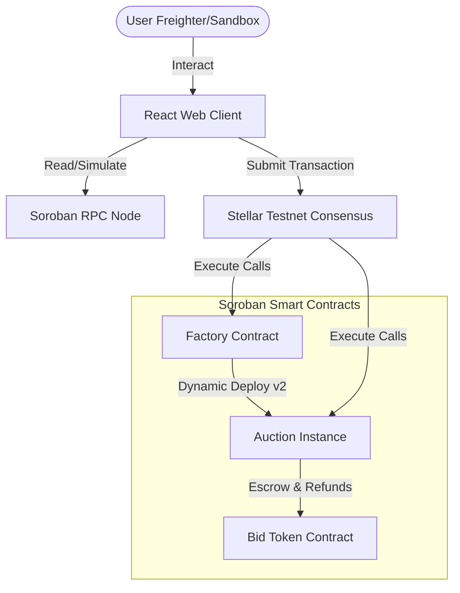

# Real-Time Auction dApp (Level 3 – Orange Belt)

A production-grade, end-to-end decentralized Auction application built on the **Stellar Soroban Testnet** with Rust smart contracts and a React/Vite/TypeScript front-end interface.

## 🏗️ Architecture Overview

The dApp comprises a Factory contract that dynamically spawns isolated, stateful Auction contracts, and a front-end client executing transactions via Freighter Wallet and Soroban RPC.



### Smart Contract Specifications
1. **Dynamic Factory (`contracts/factory`)**:
   - `create_auction(seller, token, item_name, item_metadata_uri, reserve_price, duration_secs) -> Address`: Instantiates a new auction contract with the stored Wasm hash, sets up initial metadata, and emits an `auction_created` event.
   - `list_auctions() -> Vec<Address>`: Returns all active/completed auction addresses.
2. **Dynamic Auction (`contracts/auction`)**:
   - `bid(bidder, amount)`: Places a bid. Authenticates the bidder via `require_auth()`. Rejects if the auction has expired, if the bid is below the reserve, or if it doesn't exceed the current highest bid. Immediately refunds the previous highest bidder.
   - **Anti-Sniping**: Automatically extends the auction deadline by 60 seconds if a bid is placed within the last 60 seconds of the auction.
   - `end_auction(caller)`: Finals and closes the auction. Automatically routes the highest bid from escrow to the seller, or refunds the bidder if the reserve price was not met.

---

## 🚀 Key Frontend Features

1. **Stellar Wallets Kit**: Integrates `@creit.tech/stellar-wallets-kit` to request secure transaction signatures from the Freighter extension.
2. **Transaction Lifecycle Overlay**: Displays real-time updates through each transaction stage:
   `Building/Simulating` ➔ `Awaiting Signature` ➔ `Broadcasting` ➔ `Confirming on Ledger` ➔ `Success/Error`.
3. **Live Event Ledger**: Polls RPC nodes to decode event topics (`auction_created`, `new_bid`, `auction_ended`) and display updates.
4. **Sandbox Simulation Fallback**: Offers a fully functional mock wallet sandbox mode so users can instantly test the app lifecycle without Freighter installed.
5. **Aesthetics**: Glassmorphic dark styling, responsive metrics dashboard, and real-time countdown progress bars.

---

## 🛠️ Quick Start

### Prerequisites
- [Rust & Cargo](https://rustup.rs/) (Stable 1.82+ or 1.81.0)
- [Target wasm32v1-none](https://developers.stellar.org/docs/smart-contracts/getting-started/setup)
- [Node.js](https://nodejs.org/) v18+ & npm

### 1. Compile Smart Contracts
Enable WebAssembly compilation and build target WASM files:
```bash
# Build WASM binaries
cargo build --target wasm32v1-none --release
```

### 2. Run Rust Unit Tests
Disable incremental compilation to prevent file conflicts:
```bash
# Set incremental flag and run contract tests
$env:CARGO_INCREMENTAL=0; cargo test
```

### 3. Launch Frontend Web App
Install dependencies and spin up the Vite development server:
```bash
cd frontend
npm install --legacy-peer-deps
npm run dev
```

### 4. Run Frontend Unit Tests
Execute the Vitest test suites:
```bash
cd frontend
npm run test
```

---

## 🔗 Environment Variables (.env)
Configure your client settings in `frontend/.env`:
```env
VITE_STELLAR_RPC_URL=https://soroban-testnet.stellar.org
VITE_STELLAR_NETWORK_PASSPHRASE=Test Stellar Network ; September 2015
VITE_FACTORY_CONTRACT_ADDRESS=CAUC... # Your deployed Factory address
VITE_TOKEN_CONTRACT_ADDRESS=CDLZFC3SYJYDZT7K67VZ75HPJFCBQ2BBVGTICN2V45PESTCTFBX6JGSZ # Wrapped XLM
```
