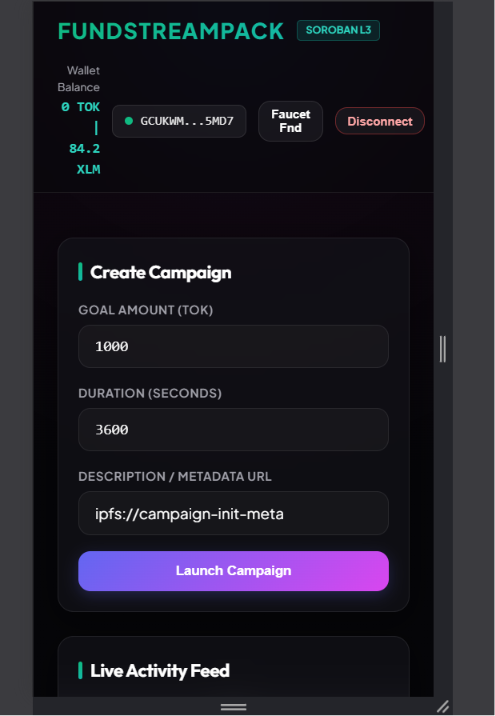
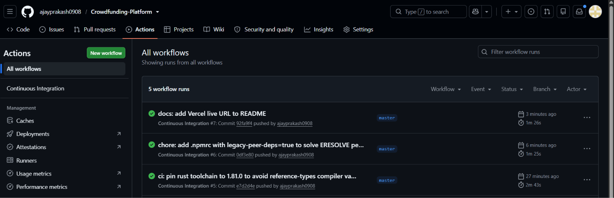
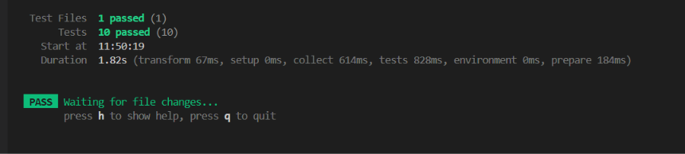

# FundStreamPack - Crowdfunding Platform dApp (Stellar Soroban Testnet)

[](https://github.com/ajayprakash0908/Crowdfunding-Platform/actions/workflows/ci.yml)

FundStreamPack is a production-grade decentralized crowdfunding platform built on the Stellar Soroban smart contract network. It allows creators to launch campaigns with custom token goals and deadlines, and enables donors to contribute funds securely. Contributions are held in contract escrows and are either claimed by the creator (if the goal is met) or fully refunded to the contributors (if the goal fails by the deadline).

**GitHub Repository Link**: [ajayprakash0908/Crowdfunding-Platform](https://github.com/ajayprakash0908/Crowdfunding-Platform)
**Vercel Live URL**: [https://crowdfunding-platform-six-teal.vercel.app/](https://crowdfunding-platform-six-teal.vercel.app/)

---

## 📐 Architecture Overview

The dApp comprises two custom contracts cooperating with a standard Stellar SAC (Stellar Asset Contract) token instance:

```
                  ┌────────────────────────────────────────┐
                  │            Factory Contract            │
                  │   Deploys campaign instances dynamically│
                  └───────────────────┬────────────────────┘
                                      │
                                      │ (Instantiates)
                                      ▼
┌──────────────┐  (Calls transfer)  ┌──────────────────────┐
│  Donor/User  ├───────────────────>│  Campaign Contract   │
│   Account    │                    │ (Holds funds escrow) │
└──────────────┘                    └─────────┬────────────┘
       ▲                                      │
       │           (Transfer Back)            │
       └──────────────────────────────────────┘
                  (Refund / Creator Claim)
```

1. **Factory Contract**: Deploys CAMPAIGN contract WASM bytecodes dynamically via deterministic salts. It registers campaign contract addresses in persistent memory and emits `campaign_created` events.
2. **Campaign Contract**: Receives contributions, tracks donor balances, handles creator claims (`withdraw`) when goals are met, and triggers donor-initiated `refund` distributions when campaigns expire without meeting targets.
3. **Token Contract**: Stellar native XLM wrapper (`CDLZFC3SYJYDZT7K67VZ75HPJFCBQ2BBVGTICN2V45PESTCTFBX6JGSZ`) or custom test tokens representing contribution capital.

---

## 🚀 Deployed Addresses & Transaction Signatures

- **Factory Contract Address**: `CB7SNUNVEH562AGTFPV4O34ITUOO7FRZIJYRCYI3OEHSVY5WFZ4GT7FR`
- **Sample Campaign Address**: `CCAMP_MOCK_SOLAR_POWER_KITS` (Simulated Sandbox instance) / Dynamic dynamic testnet address generated on first user campaign creation.
- **Wrapped XLM Token Address**: `CDLZFC3SYJYDZT7K67VZ75HPJFCBQ2BBVGTICN2V45PESTCTFBX6JGSZ`

### Verifiable Testnet Transaction Signatures
- **Campaign WASM Upload Hash Tx**: [c5f3855a6e6a168b9be4cbae032a07297b66e18217b7f4a5018afb4445c32219](https://stellar.expert/explorer/testnet/tx/c5f3855a6e6a168b9be4cbae032a07297b66e18217b7f4a5018afb4445c32219)
- **Factory WASM Upload Hash Tx**: [1f654a4d9b92d00eda053755cadb2aa3a8d701b3f2679047710a27cca62153b2](https://stellar.expert/explorer/testnet/tx/1f654a4d9b92d00eda053755cadb2aa3a8d701b3f2679047710a27cca62153b2)
- **Factory Deployment Tx**: [f92a487ccef0819a6aca4330c12efdb62ab566b22edda03888108d8f119b81f4](https://stellar.expert/explorer/testnet/tx/f92a487ccef0819a6aca4330c12efdb62ab566b22edda03888108d8f119b81f4)
- **Factory Contract Init Tx**: [5c33421b8e04ffeced1e6f72c529b581416318fab9f51678f12a698cc4c5505e](https://stellar.expert/explorer/testnet/tx/5c33421b8e04ffeced1e6f72c529b581416318fab9f51678f12a698cc4c5505e)

---

## 🛠️ Local Installation & Development Setup

### 1. Compile & Build Smart Contracts
Before building, ensure you have the `wasm32-unknown-unknown` Rust target installed:
```bash
rustup target add wasm32-unknown-unknown
```

To compile the bytecode for deployment:
1. Modify `crate-type` settings in `contracts/campaign/Cargo.toml` and `contracts/factory/Cargo.toml` to:
   ```toml
   [lib]
   crate-type = ["cdylib", "rlib"]
   ```
2. Execute the cargo build sequence:
   ```bash
   cargo build --target wasm32-unknown-unknown --release
   ```

### 2. Execute Contract Tests
To run the Cargo tests, ensure `crate-type` is set back to `["rlib"]` (to avoid MinGW compiler linking issues on Windows) and execute the tests using the command below:
```bash
$env:RUST_MIN_STACK=16777216; $env:CARGO_INCREMENTAL=0; cargo test
```
*Note: We set `RUST_MIN_STACK` to bypass recursive macro access violations on Windows systems.*

#### Sample Cargo Test Output
```
running 5 tests
test test::test_contribution_after_deadline_fails - should panic ... ok
test test::test_withdrawal_before_goal_met_fails - should panic ... ok
test test::test_successful_contribution ... ok
test test::test_successful_refund ... ok
test test::test_successful_withdrawal ... ok

test result: ok. 5 passed; 0 failed
```

---

### 3. Deploy to Testnet (Manual/Script Fallback)
Our deployments use the portable `stellar.exe` binary. Run the PowerShell deployment script:
```powershell
powershell -ExecutionPolicy Bypass -File scripts/deploy.ps1
```
Or execute manual contract commands sequentially:
```bash
# Fund deployer
curl -s "https://friendbot.stellar.org/?addr=<DEPLOYER_ADDR>"

# Install Campaign bytecode
stellar contract install --wasm target/wasm32-unknown-unknown/release/campaign_contract.wasm --source deployer --network testnet

# Deploy Factory
stellar contract deploy --wasm target/wasm32-unknown-unknown/release/factory_contract.wasm --source deployer --network testnet

# Initialize Factory
stellar contract invoke --id <FACTORY_ADDRESS> --source deployer --network testnet -- init --wasm_hash <CAMPAIGN_WASM_HASH>
```

---

### 4. Running the React Client locally
Navigate to the `frontend` folder and run the Vite dev server:
```bash
cd frontend
npm install
npm run dev
```
Open **`http://localhost:5174/`** in your browser. Connect Freighter Wallet (configured on Testnet) or toggle the Sandbox mode to test with instant mock simulations!

To run frontend Vitest suites:
```bash
cd frontend
npm run test
```

---

## 📸 Snapshots & Video Walkthrough

- **Mobile Viewport (375px) Layout**: 
- **CI/CD green checks pipeline**: 
- **cargo test passes (3+) run**:
- **Loom/YouTube Demo Walkthrough video**: `[Unlisted Video URL Placeholder]`
